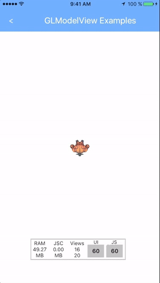
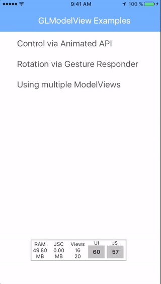
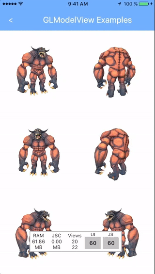

# react-native-gl-model-view

[](https://badge.fury.io/js/react-native-gl-model-view)


A `<GLModelView>` component for [react-native](github.com/facebook/react-native/), allowing you to
display and animate any Wavefront .OBJ 3D object. Realized with a native bridge to [GLView](https://github.com/nicklockwood/GLView).

  

Main features:

* Display, rotate, scale and translate any textured 3D object!
* Animate with blasting fast 60FPS by using the [Animated API](https://facebook.github.io/react-native/docs/animations.html#using-the-native-driver) native driver
* Load any Wavefront .OBJ or GLEssentials model
* Use all texture image formats supported by [UIImage](https://developer.apple.com/library/content/documentation/2DDrawing/Conceptual/DrawingPrintingiOS/LoadingImages/LoadingImages.html#//apple_ref/doc/uid/TP40010156-CH17-SW8)

## Requirements

* iOS - feel free to PR an Android port ;)
* Cocoapods - to install the [GLView](https://github.com/nicklockwood/GLView) dependency.

## Getting started

You can install and try linking the project automatically:

`$ react-native add react-native-gl-model-view`

or do it manually as described below:

### Manual installation

`$ npm install --save react-native-gl-model-view`

Afterwards add following lines to your Podfile:

```sh
pod 'React', :path => '../node_modules/react-native'
pod 'RNGLModelView', :path => '../node_modules/react-native-gl-model-view'
```

## Usage

```javascript
import ModelView from 'react-native-gl-model-view';

<ModelView
    model="model.obj"
    texture="texture.png"

    scale={0.01}

    translateZ={-2}
    rotateZ={270}

    style={{flex: 1}}
/>
```

Check out the [example project](https://github.com/rastapasta/react-native-gl-model-view/tree/master/example)!

To build it, switch into the `example` folder and set it up as following:

```sh
$ npm install
$ cd ios
$ pod install
$ cd ..
$ react-native run-ios
```

### Properties

| Prop  | Default  | Type | Description |
| :------------ |:---------------:| :---------------:| :-----|
| model | *required* | `string` | Filename of the model, must be included via Xcode |
| texture | undefined | `string` | Filename of the texture, must be included via Xcode |
| animate | false | `bool` | Set to `true` re-renders the model each 1/60s |
| scale | 1 | `number` | Scale all axis of the mode by given factor (overwrites scale*)|
| scaleX | 1 | `number` | Scale X axis by given factor |
| scaleY | 1 | `number` | Scale Y axis by given factor |
| scaleZ | 1 | `number` | Scale Z axis by given factor |
| rotateX | 0 | `number` | rotate around X axis by given degree |
| rotateY | 0 | `number` | rotate around Y axis by given degree |
| rotateZ | 0 | `number` | rotate around Z axis by given degree |
| translateX | 0 | `number` | translates X position by given factor |
| translateY | 0 | `number` | translates Y position by given factor |
| translateZ | 0 | `number` | translates Z position by given factor |

## License

#### The MIT License (MIT)

Copyright (c) 2017 Michael Straßburger

Permission is hereby granted, free of charge, to any person obtaining a copy of this software and associated documentation files (the "Software"), to deal in the Software without restriction, including without limitation the rights to use, copy, modify, merge, publish, distribute, sublicense, and/or sell copies of the Software, and to permit persons to whom the Software is furnished to do so, subject to the following conditions:

The above copyright notice and this permission notice shall be included in all copies or substantial portions of the Software.

THE SOFTWARE IS PROVIDED "AS IS", WITHOUT WARRANTY OF ANY KIND, EXPRESS OR IMPLIED, INCLUDING BUT NOT LIMITED TO THE WARRANTIES OF MERCHANTABILITY, FITNESS FOR A PARTICULAR PURPOSE AND NONINFRINGEMENT. IN NO EVENT SHALL THE AUTHORS OR COPYRIGHT HOLDERS BE LIABLE FOR ANY CLAIM, DAMAGES OR OTHER LIABILITY, WHETHER IN AN ACTION OF CONTRACT, TORT OR OTHERWISE, ARISING FROM, OUT OF OR IN CONNECTION WITH THE SOFTWARE OR THE USE OR OTHER DEALINGS IN THE SOFTWARE.
